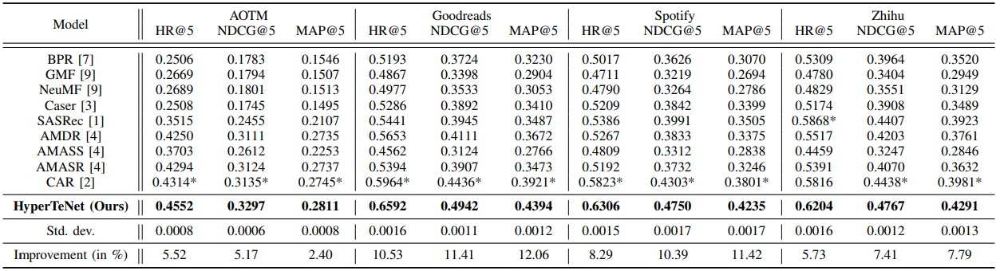

# HyperTeNet
#### Hypergraph and Transformer-based Neural Network for Personalized List Continuation, ICDM 2021. Vijaikumar M, Deepesh Hada, Shirish Shevade

------------
### Dependencies
Download the code from this anonymized
[link](https://drive.google.com/file/d/1LN2EcGuj0zDw9M1WYv6nuHi6rkwtolAH/view?usp=sharing)
and make sure that the environment is CUDA-enabled. The code works on
Python 3.5+.

To install the dependencies, use:

`pip install requirements.txt`

If the requirements installation fails for some reason, you can use the
following scripts to install the PyTorch components individually:

```Python
pip install torch==1.4.0+cu100 torchvision==0.5.0+cu100 -f https://download.pytorch.org/whl/torch_stable.html
pip install --no-index torch-scatter==2.0.4 -f https://pytorch-geometric.com/whl/torch-1.4.0+cu100.html
pip install --no-index torch-sparse==0.6.1 -f https://pytorch-geometric.com/whl/torch-1.4.0+cu100.html
pip install --no-index torch-cluster==1.5.4 -f https://pytorch-geometric.com/whl/torch-1.4.0+cu100.html
pip install --no-index torch-spline-conv==1.2.0 -f https://pytorch-geometric.com/whl/torch-1.4.0+cu100.html
pip install torch-geometric==1.4.2 -q
```

------------
### Extract Dataset
To train or evaluate **HyperTeNet** on a dataset, extract the zipped
dataset in the [data](data/) directory. The datasets can be downloaded
from [here](https://drive.google.com/drive/folders/1ravjFWBgUb_cgpn2Z00ELKyY3CNQXqiv?usp=sharing).

------------
### Training and Evaluation
Use the following scripts to train/evaluate the model. For evaluation,
make sure that a trained model corresponding to a dataset is present in
the [saved_models](saved_models/) directory.

**1. Art of the Mix (AOTM)**

*Train:* `python train.py --path="./data/aotm/" --dataset="aotm"
--num_layers=2 --num_epochs=300 --num_negatives=5 --num_negatives_seq=2
--lr=0.001`

*Evaluate:* `python eval.py --path="./data/aotm/" --dataset="aotm" --num_layers=2`

**2. Goodreads**

*Train:* `python train.py --path="./data/goodreads/"
--dataset="goodreads" --num_layers=2 --num_epochs=300 --num_negatives=3
--num_negatives_seq=4 --lr=0.0007`

*Evaluate:* `python eval.py --path="./data/goodreads/"
--dataset="goodreads" --num_layers=2`

**3. Spotify**

*Train:* `python train.py --path="./data/spotify/" --dataset="spotify"
--num_layers=3 --num_epochs=300 --num_negatives=3 --num_negatives_seq=5
--lr=0.0008`

*Evaluate:* `python eval.py --path="./data/spotify/" --dataset="spotify"
--num_layers=3`

**4. Zhihu**

*Train:* `python train.py --path="./data/zhihu/" --dataset="zhihu"
--num_layers=3 --num_epochs=300 --num_negatives=5 --num_negatives_seq=6
--lr=0.002`

*Evaluate:* `python eval.py --path="./data/zhihu/" --dataset="zhihu" --num_layers=3`

------------
### Results
Evaluating the trained models present in the
[saved_models](saved_models/) directory using the above commands can be
used to get results similar to the ones reported in the following
[table](images/results_table.jpg):



------------------
